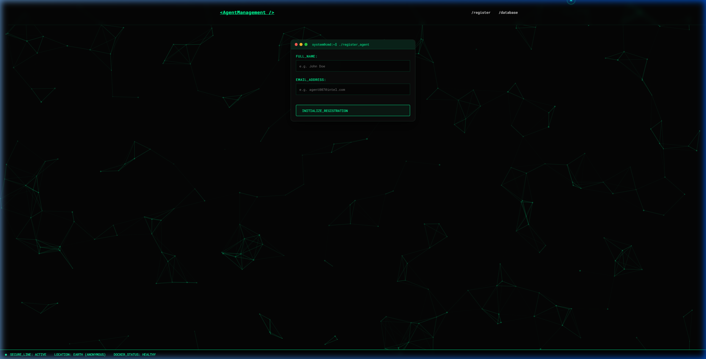
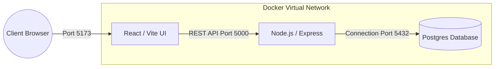
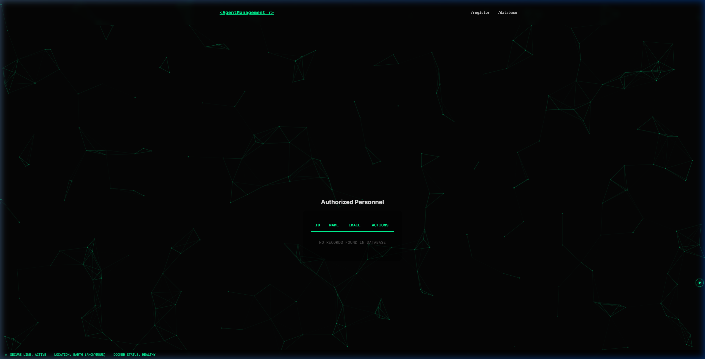

# <p align="center">🕵️‍♂️ AgentManagement - Personnel Intelligence System</p>

<p align="center">
  
  
  
  
  
</p>

---

## 🌟 Overview
**AgentManagement** is an ultra-modern, containerized personnel management platform designed for the **SENG-384 Docker Assignment**. Built with a focus on high-fidelity user experience and robust system orchestration, it provides a seamless interface for managing sensitive personnel data through a fully localized micro-services architecture.

<p align="center">
  
</p>

---

## 🏗️ System Architecture & Workflow
The platform utilizes a state-of-the-art tech stack orchestrated via Docker to ensure 100% environment parity.



### 🛰️ Core Infrastructure
1.  **Frontend (React 19)**: Features a high-performance Cyberpunk-themed UI, utilizing GSAP for ultra-smooth transitions and a custom interactive terminal for registration validation.
2.  **Backend (Express API)**: A rigid RESTful gateway implementing logic for the complete CRUD lifecycle, handling direct secure communication with the database layer.
3.  **Database (PostgreSQL 16)**: Containerized persistence layer with automated schema initialization via `init.sql`.

---

## 🛠️ Key Features & Interactive UI

<p align="center">
  
</p>

### 🛡️ SECURE_REGISTRATION (Route: `/`)
- **Real-time Validation**: Validates agent data before transmission.
- **Unique Constraints**: Prevents duplicate entries via database-level email indexing.
- **Micro-Animations**: Features neon pulse effects and GL-glitch title transitions.

### 📊 DATA_CORE (Route: `/people`)
- **Full CRUD Support**: Manage agents with **Create, Read, Update, and Delete** capabilities.
- **Responsive Terminal Table**: A retro-futuristic data grid optimized for massive data clarity.
- **Database Synchronization**: Real-time updates with persistent storage.

---

## 🐳 Docker Orchestration Details

This assignment showcases professional-grade Docker implementation:
- **Persistence**: Relational data is mapped to a named volume (`pgdata`), ensuring persistence across container rebuilds.
- **Networking**: All services reside in a dedicated bridge network, allowing secure internal communication via service names.
- **Automation**: Database tables are automatically provisioned on the first start using a mounted `init.sql`.

### ⚡ Quick Start Guide

1.  **Preparation:**
    ```bash
    git clone https://github.com/cozalss/SENG384-project.git
    cd "SENG384-project/B-SENG-384 Docker assignment - Cem OZAL- 202228203"
    cp .env.example .env
    ```

2.  **Deployment:**
    ```bash
    docker compose up --build
    ```

3.  **Access:**
    - Dashboard: [http://localhost:5173](http://localhost:5173)
    - API Health: [http://localhost:5000/api/health](http://localhost:5000/api/health)

---

## 📝 Compliance Checklist (SENG-384)
- [x] **Database Schema**: `people` table with `id`, `full_name`, and `email` (unique).
- [x] **Backend CRUD**: 
    - `POST /api/people` (Create)
    - `GET /api/people` (Read)
    - `PUT /api/people/:id` (Update)
    - `DELETE /api/people/:id` (Delete)
- [x] **Frontend Routes**: 
    - `/` (Registration Form)
    - `/people` (People Table)
- [x] **Database Init**: `init.sql` mounted to `/docker-entrypoint-initdb.d/`.
- [x] **Environment Variables**: `.env.example` provided and used by backend.
- [x] **Schema Compliance**: `people` table with `id`, `full_name`, and `email` (unique).
- [x] **API Standards**: Full RESTful implementation on specialized container endpoints.
- [x] **Docker Standards**: Independent Dockerfiles with optimized builds.
- [x] **Volume Management**: Persistent PostgreSQL mapping.
- [x] **Env Validation**: Secure variable management via `.env` integration.

---

<p align="center">
  Developed with ❤️ and Cybernetic precision by <b>Cem Özal</b><br>
  <i>SENG-384 Docker Assignment - 202228203</i>
</p>
