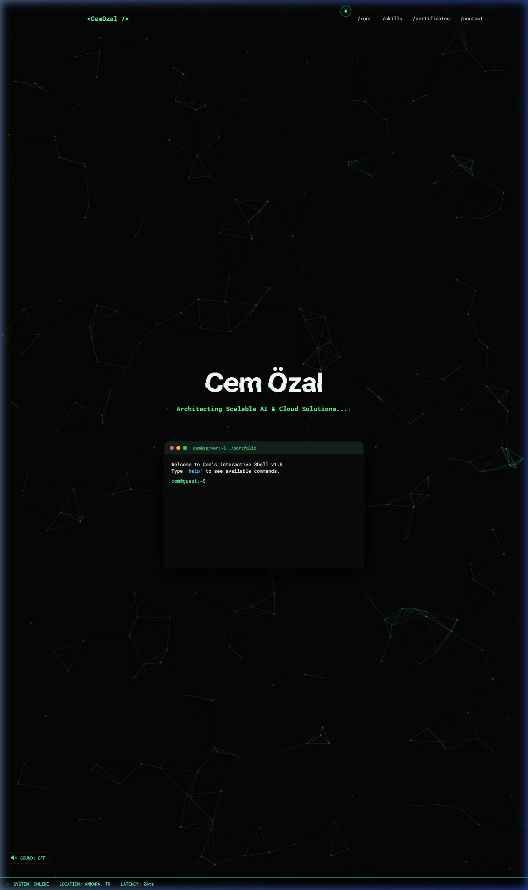
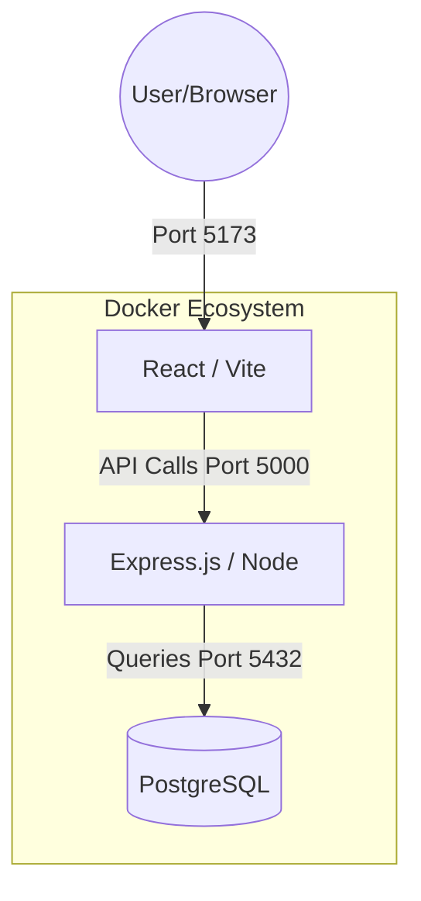
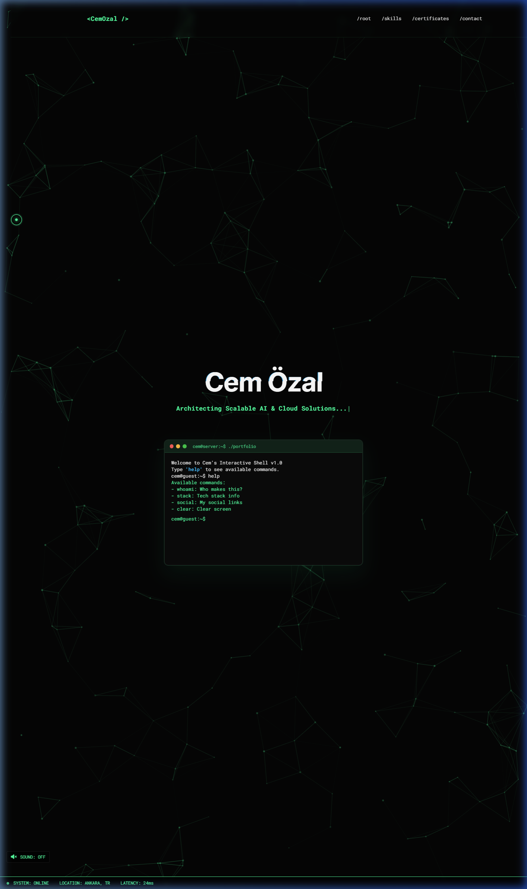
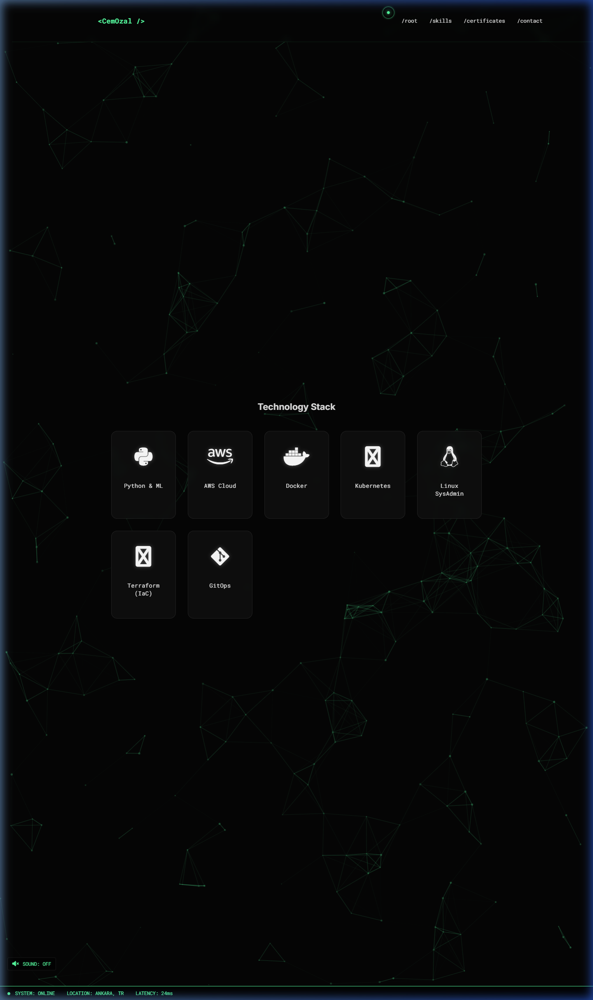
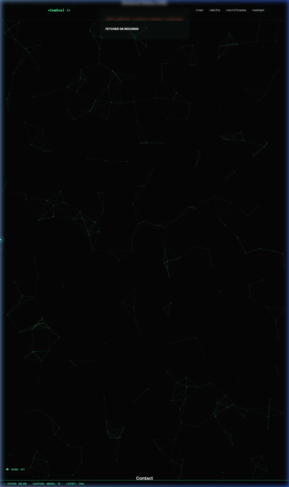

# <p align="center">🚀 LexiAI - Full-Stack Portfolio & MLOps Platform</p>

<p align="center">
  
  
  
  
  
</p>

---

## 🌟 Overview
**LexiAI** is a premium, containerized full-stack application developed for the **SENG-384 Docker Assignment**. It serves as a professional portfolio platform for DevOps and MLOps engineers, featuring an interactive terminal, real-time backend health monitoring, and a fully orchestrated database layer.

<p align="center">
  
</p>

---

## 🏗️ System Architecture
The project follows a modern microservices-inspired architecture, ensuring complete isolation and scalability of each component.



### 🛰️ Core Services
1.  **Frontend (React/Vite)**: A state-of-the-art UI with GSAP-powered animations, interactive terminal emulator, and 3D card components.
2.  **Backend (Express.js)**: A robust REST API serving as the bridge between the UI and the data layer, featuring built-in health checks and environment-aware configuration.
3.  **Database (PostgreSQL)**: A containerized relational database for persistent storage of portfolio items and system logs.

---

## 🛠️ Technology Stack & Interactive Features

<p align="center">
  
  
</p>

### 🖥️ Interactive Terminal Emulator
The dashboard includes a fully functional CLI where users can interact with the system:
- `whoami`: Displays developer information.
- `stack`: Shows the technical capabilities of the platform.
- `social`: Links to professional accounts.
- `clear`: Resets the terminal output.

---

## 🐳 Docker Orchestration
This project is engineered to be environment-agnostic. The entire stack is orchestrated using **Docker Compose**, managing volumes, networking, and service interdependencies.

### 🛠️ Installation & Setup

Follow these steps to get the project running on your local machine:

1.  **Clone the Repository:**
    ```bash
    git clone https://github.com/cozalss/SENG384-project.git
    cd SENG384-project
    ```

2.  **Environment Configuration:**
    The project is pre-configured for Docker. If you need to change database credentials, update the `docker-compose.yml` and the `.env` file in the `backend` folder.

3.  **Launch with Docker:**
    Make sure Docker Desktop is running, then execute:
    ```bash
    docker compose up --build
    ```

4.  **Verify Services:**
    Once the containers are up, you can access the frontend at `http://localhost:5173`.

### 🔗 Service Discovery
| Service | URL | Role |
| :--- | :--- | :--- |
| **User Interface** | [http://localhost:5173](http://localhost:5173) | Main Dashboard |
| **Backend API** | [http://localhost:5000](http://localhost:5000) | REST Gateway |
| **System Health** | [http://localhost:5000/api/health](http://localhost:5000/api/health) | API Status Monitor |
| **PostgreSQL** | `localhost:5432` | Data Persistence |

---

## 📊 Backend Logic & Data Flow (Assignment Focus)

<p align="center">
  
</p>

- **Container Networking**: Frontend uses environment variables to communicate with the internal Docker network.
- **Persistence**: Database data is mapped to a Docker volume (`pgdata`), ensuring no data loss when containers are stopped.
- **Health Checks**: Backend service waits for the PostgreSQL health check before initializing, preventing connection timeout errors.

---

## 📝 Compliance Checklist (SENG-384)
- [x] **Frontend Dockerization**: Custom `Dockerfile` for Vite environment.
- [x] **Backend Dockerization**: Multi-stage build (or optimized Node Dockerfile).
- [x] **Orchestration**: Comprehensive `docker-compose.yml` file.
- [x] **Documentation**: Full setup and architecture guide.
- [x] **Data Integrity**: Volume mapping for PostgreSQL database.

---

## 🎨 Creative Design Credits
- **Aesthetic**: Cyberpunk / Terminal Dark Mode
- **Animations**: GSAP, Vanilla-Tilt, tsParticles
- **Typography**: Space Grotesk / JetBrains Mono

---

<p align="center">
  Developed with 🧠 and 🐳 by <b>Cem Özal</b><br>
  <i>Student ID: 202228203 | SENG-384 2026</i>
</p>