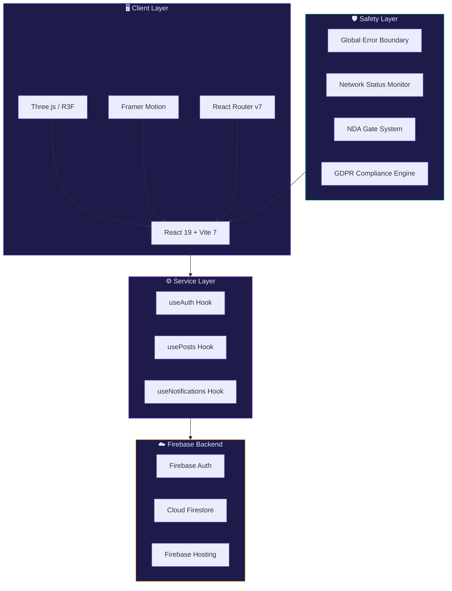
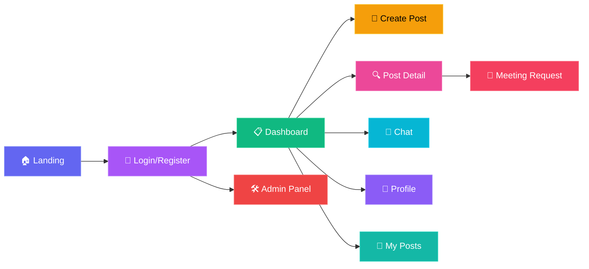

<div align="center">

<!-- Animated Header Banner -->


<br/>

<!-- Typing SVG -->
<a href="https://git.io/typing-svg"></a>

<br/><br/>

<!-- Premium Badge Row -->
<p>
  
  
  
  
  
</p>

<p>
  
  
  
  
  
</p>

<br/>

> **A competition-grade, ultra-premium platform bridging clinical expertise with technical engineering.**  
> *Real-time synchronization · Adaptive 3D graphics · Industry-leading UX · GDPR & NDA protections*

<br/>

<!-- 🔥 LIVE SITE CTA — tek tıkla kutucuk -->
<a href="https://de27omk8jz7if.cloudfront.net/" target="_blank" rel="noopener noreferrer">
  
</a>

<br/>
<sub>🔗 <a href="https://de27omk8jz7if.cloudfront.net/"><code>de27omk8jz7if.cloudfront.net</code></a> &nbsp;·&nbsp; <i>deployed on AWS S3 + CloudFront</i></sub>

<br/><br/>


</div>

<br/>

## 🏛️ Table of Contents

<details>
<summary><b>📖 Click to expand</b></summary>

- [🌟 Vision](#-vision)
- [✨ Features](#-features-that-set-us-apart)
- [🏗️ Architecture](#️-system-architecture)
- [💻 Tech Stack](#-tech-stack)
- [📁 Project Structure](#-project-structure)
- [🚀 Quick Start](#-quick-start)
- [📱 Pages & Modules](#-pages--modules)
- [🛡️ Security & Stability](#️-security--stability)
- [🧪 How It Works](#-how-it-works)
- [📄 Documentation](#-documentation)
- [👥 Team Health Shield](#-team-health-shield)

</details>

<br/>

## 🌟 Vision

<table>
<tr>
<td width="60%">

### The Problem

In today's landscape, **Medical Professionals** identify critical problems every day but lack the technical tools to solve them. Conversely, **Engineers** have the technical power but lack real-world clinical validation.

### The Solution

**Health AI** is the **Bridge.** A secure, NDA-protected marketplace where these two worlds collide to create **life-saving innovations.**

> *"We don't just connect people. We create the conditions for breakthrough collaboration."*

</td>
<td width="40%" align="center">

```
    🏥 Healthcare          🔧 Engineering
    ┌──────────┐          ┌──────────┐
    │ Clinical │          │ Technical│
    │  Needs   │◄────────►│  Power   │
    │          │          │          │
    └────┬─────┘          └────┬─────┘
         │                     │
         └────────┬────────────┘
                  │
           ┌──────┴──────┐
           │  🛡️ HEALTH  │
           │   SHIELD    │
           │  ──────────  │
           │  Innovation │
           │  Platform   │
           └─────────────┘
```

</td>
</tr>
</table>

<br/>

## ✨ Features That Set Us Apart

<div align="center">

| Feature | Description | Status |
|:---:|:---|:---:|
| 🌌 **Adaptive 3D DNA Helix** | Custom Three.js scene with 1000+ particles, deep bloom effects, auto-LOD for mobile | ✅ Live |
| 🖱️ **Interactive Parallax** | Mouse & scroll-responsive 3D background with "window" depth effect | ✅ Live |
| 💬 **Real-Time Messaging** | Firebase-powered instant chat with typing indicators & message management | ✅ Live |
| 🔍 **Global Smart Search** | High-performance filtering by domain, country, city, stage & status | ✅ Live |
| 📱 **Mobile-First Design** | Automatic LOD, responsive grids, hand-tuned for every screen size | ✅ Live |
| 🎨 **Glassmorphism 2.0** | High-end CSS backdrop filters with modern OS-level transparency | ✅ Live |
| 🔐 **NDA Protection** | Meetings gated behind NDA acceptance — IP never exposed | ✅ Live |
| 🇪🇺 **GDPR Compliance** | Right to Erasure, Data Portability (JSON export), minimal data collection | ✅ Live |
| 🌙 **Theme System** | Dark/Light mode with smooth animated transitions | ✅ Live |
| 🔔 **Smart Notifications** | Real-time alerts for interest, meetings & status changes | ✅ Live |

</div>

<br/>

<details>
<summary><b>🌌 Premium Visual Experience (click to expand)</b></summary>

<br/>

- **Adaptive 3D DNA Helix** — A custom-built Three.js scene that dynamically adjusts its complexity based on device performance. Desktop users enjoy 1000+ particles and deep bloom effects, while mobile users get a buttery-smooth, optimized experience.
  
- **Interactive Depth (Parallax)** — The entire 3D background responds to mouse and scroll movements, creating a "window" effect that pulls users into the platform.

- **Glassmorphism 2.0** — Every panel uses high-end CSS backdrop filters, providing a professional, semi-transparent feel consistent with modern OS designs.

- **Scroll-Reveal Animations** — Staggered scroll-triggered animations with customizable direction (up, down, left, right, scale) using intersection observers.

- **Mouse-Follow Glow** — Subtle radial gradient glow follows cursor position across the hero section for an immersive feel.

- **Micro-Interactions** — Tilt effects on cards (react-parallax-tilt), spring-based hover animations, and smooth page transitions powered by Framer Motion.

</details>

<details>
<summary><b>💬 Enterprise Real-Time Messaging (click to expand)</b></summary>

<br/>

- **Instant Synchronization** — Powered by Firebase Firestore, messages appear instantly across devices without page reloads.
- **Typing Indicators** — Real-time visibility when the other party is typing.
- **Message Management** — Delete conversations or clear history with a single click.
- **Avatar Synchronization** — Consistent, professional UI across all messaging surfaces.
- **Global User Search** — Find conversations or new users instantly.

</details>

<br/>

## 🏗️ System Architecture



<br/>

## 💻 Tech Stack

<div align="center">

| Layer | Technology | Purpose |
|:---:|:---:|:---|
| ⚛️ **Frontend** | React 19 | Component architecture & state management |
| ⚡ **Build** | Vite 7 | Next-gen build speeds & HMR |
| ☁️ **Backend** | Firebase | Auth, Firestore, Hosting |
| 🎮 **3D Graphics** | Three.js + R3F | Adaptive DNA helix & particle systems |
| 🎬 **Animation** | Framer Motion | Micro-interactions & page transitions |
| 🧭 **Routing** | React Router v7 | Client-side navigation |
| 🎯 **Icons** | Lucide React | Consistent icon system |
| 🃏 **Effects** | React Parallax Tilt | 3D card hover effects |
| ✨ **Particles** | tsParticles | Background particle systems |
| 📧 **Email** | EmailJS | Contact & notification emails |
| 🎨 **Styling** | Vanilla CSS | Custom design system with global tokens |

</div>

<br/>

## 📁 Project Structure

```
Seng384/
├── 📄 index.html                    # Entry point
├── 📦 package.json                  # Dependencies & scripts
├── ⚙️ vite.config.js                # Vite configuration
├── 🔒 .env                          # Environment variables (Firebase keys)
│
├── 📁 src/
│   ├── 🚀 main.jsx                  # React DOM render
│   ├── 📱 App.jsx                   # Root component + routing
│   ├── 🎨 index.css                 # Global design system (27KB)
│   ├── 🔥 firebase.js               # Firebase initialization
│   ├── 📊 mockData.js               # Development seed data
│   │
│   ├── 📁 components/
│   │   ├── 🧬 HeroDNA.jsx           # Three.js 3D DNA helix (20KB)
│   │   ├── 🧭 Navbar.jsx            # Navigation bar
│   │   ├── 🔔 Notifications.jsx     # Real-time notification center
│   │   ├── 💥 GlobalErrorBoundary   # Crash recovery system
│   │   ├── 🌐 NetworkStatus.jsx     # Connectivity monitor
│   │   ├── 🎬 PageTransition.jsx    # Route transition animations
│   │   ├── 💀 SkeletonLoader.jsx    # Loading state placeholders
│   │   ├── 🌙 ThemeToggle.jsx       # Dark/Light mode switch
│   │   └── 🔢 AnimatedCounter.jsx   # Scroll-triggered counters
│   │
│   ├── 📁 pages/
│   │   ├── 🏠 LandingPage.jsx       # Marketing homepage (36KB)
│   │   ├── 🔑 Login.jsx             # Auth & registration (25KB)
│   │   ├── 📋 Dashboard.jsx         # Innovator feed (25KB)
│   │   ├── 📝 CreatePost.jsx        # Announcement wizard (23KB)
│   │   ├── 🔍 PostDetail.jsx        # Full post view + meetings (50KB)
│   │   ├── 💬 Chat.jsx              # Real-time messaging (17KB)
│   │   ├── 👤 Profile.jsx           # User profile & settings
│   │   ├── 📂 MyPosts.jsx           # User's announcements
│   │   └── 🛠️ AdminDashboard.jsx    # Admin control panel (25KB)
│   │
│   ├── 📁 hooks/
│   │   ├── 🔐 useAuth.js            # Authentication state
│   │   ├── 📊 usePosts.js           # Post CRUD & real-time sync
│   │   └── 🔔 useNotifications.js   # Notification management
│   │
│   ├── 📁 routes/
│   │   └── 🧭 AppRoutes.jsx         # Route definitions
│   │
│   └── 📁 services/                 # Firebase service layer
│
├── 📁 docs/
│   ├── 📸 screenshots/              # UI screenshots
│   ├── 🐍 generate_srs.py           # SRS document generator
│   ├── 🐍 generate_sdd.py           # SDD document generator
│   └── 🐍 generate_userguide.py     # User guide generator
│
├── 📄 HEALTH_AI_SRS_Document.docx   # Software Requirements Spec
├── 📄 HEALTH_AI_SDD_Document.docx   # Software Design Document
└── 📄 HEALTH_AI_User_Guide.docx     # End-user guide
```

<br/>

## 🚀 Quick Start

### Prerequisites

<table>
<tr>
<td>

```
✅ Node.js (LTS v20+)
✅ npm or yarn
✅ Git
✅ A modern browser
```

</td>
<td>

```
📋 Optional
   Firebase CLI (for deployment)
   VS Code + ESLint extension
```

</td>
</tr>
</table>

### Installation

```bash
# 1️⃣ Clone the repository
git clone https://github.com/cemozal/Seng384.git

# 2️⃣ Navigate to project directory
cd Seng384

# 3️⃣ Install dependencies
npm install

# 4️⃣ Start development server
npm run dev
```

### Available Scripts

| Command | Description |
|:---|:---|
| `npm run dev` | Start Vite dev server with HMR |
| `npm run build` | Create optimized production build |
| `npm run preview` | Preview production build locally |
| `npm run lint` | Run ESLint code quality checks |

<br/>

## 📱 Pages & Modules

<div align="center">



</div>

<br/>

| Page | Key Features |
|:---|:---|
| 🏠 **Landing Page** | Hero with 3D DNA, scroll-reveal animations, animated counters, dual-persona cards, workflow timeline |
| 🔑 **Login / Register** | Role-based auth (Engineer/Healthcare), form validation, animated transitions |
| 📋 **Dashboard** | Advanced multi-filter search, tilt-effect cards, bookmarks, match explanations, local city matching |
| 📝 **Create Post** | Step-by-step wizard, domain/stage selectors, expertise requirement builder |
| 🔍 **Post Detail** | Full announcement view, NDA-gated interest, meeting scheduler, status lifecycle |
| 💬 **Chat** | Real-time Firebase messaging, typing indicators, conversation management, user discovery |
| 👤 **Profile** | User settings, GDPR data export (JSON), account deletion, avatar management |
| 📂 **My Posts** | Personal announcements list, status management, edit/close/delete controls |
| 🛠️ **Admin Panel** | Platform analytics, user management, content moderation dashboard |

<br/>

## 🛡️ Security & Stability

<div align="center">

```
┌─────────────────────────────────────────────────────────────────────┐
│                     🛡️ HEALTH SHIELD SAFETY NET                    │
├──────────────────────┬──────────────────────────────────────────────┤
│  🌐 Network Heartbeat│  Real-time connectivity detection           │
│                      │  Stylized "Offline Mode" recovery panel     │
├──────────────────────┼──────────────────────────────────────────────┤
│  💥 Error Boundaries │  Global fault interception                  │
│                      │  Safe recovery screen (no blank pages)      │
├──────────────────────┼──────────────────────────────────────────────┤
│  🔐 NDA Protection   │  Project details gated behind NDA           │
│                      │  No IP exposed without explicit consent     │
├──────────────────────┼──────────────────────────────────────────────┤
│  🇪🇺 GDPR Compliance │  Right to Erasure (account deletion)       │
│                      │  Data Portability (full JSON export)        │
│                      │  Minimal data collection philosophy         │
├──────────────────────┼──────────────────────────────────────────────┤
│  🔒 Auth Security    │  Firebase Auth with .edu email verification │
│                      │  Role-based access control                  │
├──────────────────────┼──────────────────────────────────────────────┤
│  📱 Performance      │  Automatic LOD for 3D scenes                │
│                      │  60 FPS guaranteed on mobile devices        │
└──────────────────────┴──────────────────────────────────────────────┘
```

</div>

<br/>

## 🧪 How It Works

<div align="center">

```
   ┌─────────┐     ┌───────────┐     ┌───────────┐     ┌──────────┐     ┌───────────┐
   │  🔐     │     │  📋      │     │  🤝      │     │  📅      │     │  🚀      │
   │Register │────►│ Post or   │────►│ Express   │────►│ Schedule │────►│Collaborate│
   │         │     │ Browse    │     │ Interest  │     │ Meeting  │     │          │
   │ Step 01 │     │ Step 02   │     │ Step 03   │     │ Step 04  │     │ Step 05  │
   └─────────┘     └───────────┘     └───────────┘     └──────────┘     └───────────┘
       │                │                  │                 │                │
    Sign up         Create a           Accept NDA &       Propose time    Mark "Partner
    with .edu      structured          send message       slots, agree     Found" and
    email          announcement        to author          on a date        close post
```

</div>

<br/>

## 📄 Documentation

<div align="center">

| Document | Description | Format |
|:---:|:---|:---:|
| 📘 **SRS** | Software Requirements Specification — functional & non-functional requirements | `.docx` |
| 📗 **SDD** | Software Design Document — architecture, components & data flow | `.docx` |
| 📙 **User Guide** | End-user documentation with screenshots & step-by-step instructions | `.docx` |

</div>

<br/>

---

<br/>

## 👥 Team Health Shield

<div align="center">


<br/>

<table>
<tr>
<td align="center" width="25%">
<br/>

<br/><br/>
<b>Cem Özal</b>
<br/>
<sub>💻 Full-Stack Developer</sub>
<br/><br/>
<a href="https://github.com/cemozal"></a>
<br/><br/>
</td>
<td align="center" width="25%">
<br/>

<br/><br/>
<b>Emre Kurubaş</b>
<br/>
<sub>🎨 Frontend & UI/UX</sub>
<br/><br/>
<a href="https://github.com"></a>
<br/><br/>
</td>
<td align="center" width="25%">
<br/>

<br/><br/>
<b>Hasabu Can Eltayeb</b>
<br/>
<sub>☁️ Backend & Firebase</sub>
<br/><br/>
<a href="https://github.com"></a>
<br/><br/>
</td>
<td align="center" width="25%">
<br/>

<br/><br/>
<b>Sertaç Ataç</b>
<br/>
<sub>📋 QA & Documentation</sub>
<br/><br/>
<a href="https://github.com"></a>
<br/><br/>
</td>
</tr>
</table>

</div>

<br/>

---

<div align="center">


<br/>

### 🎓 SENG384 — Software Development 2

<sub>Çankaya University · Spring 2026</sub>

<br/>


<br/><br/>

*Crafted with ❤️ and an obsession for clean code.*

<br/>


</div>
