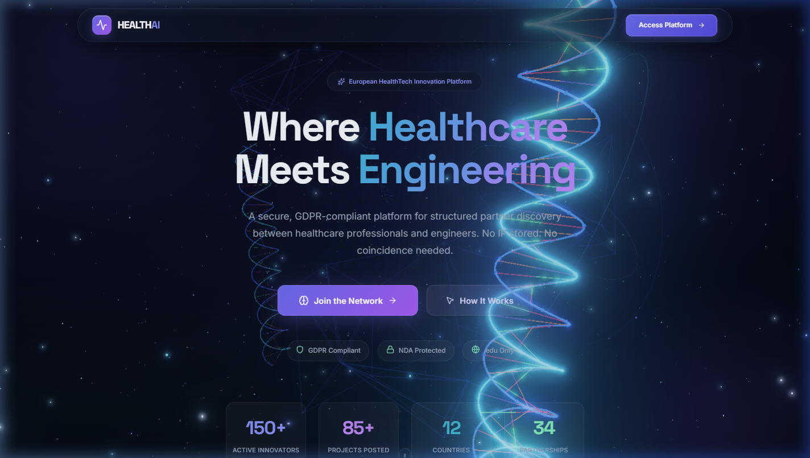
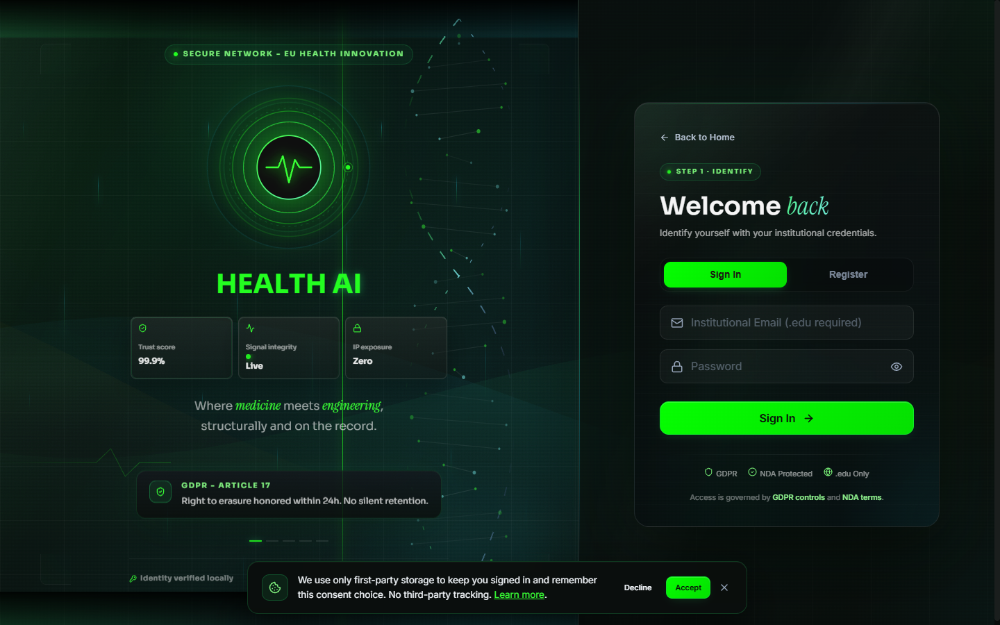
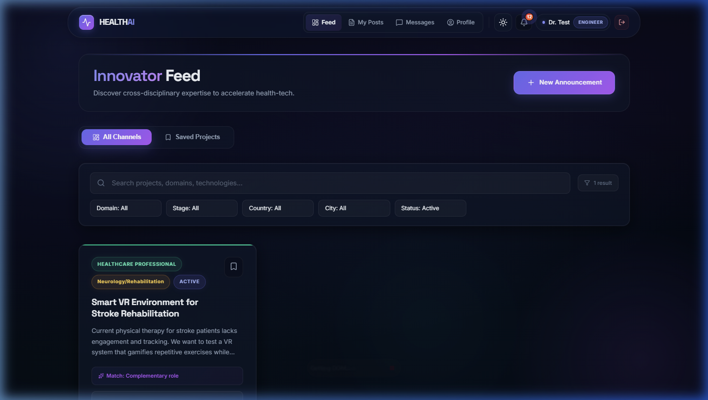
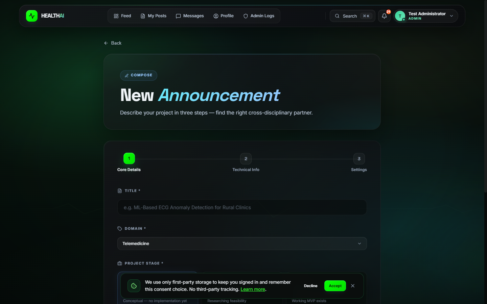
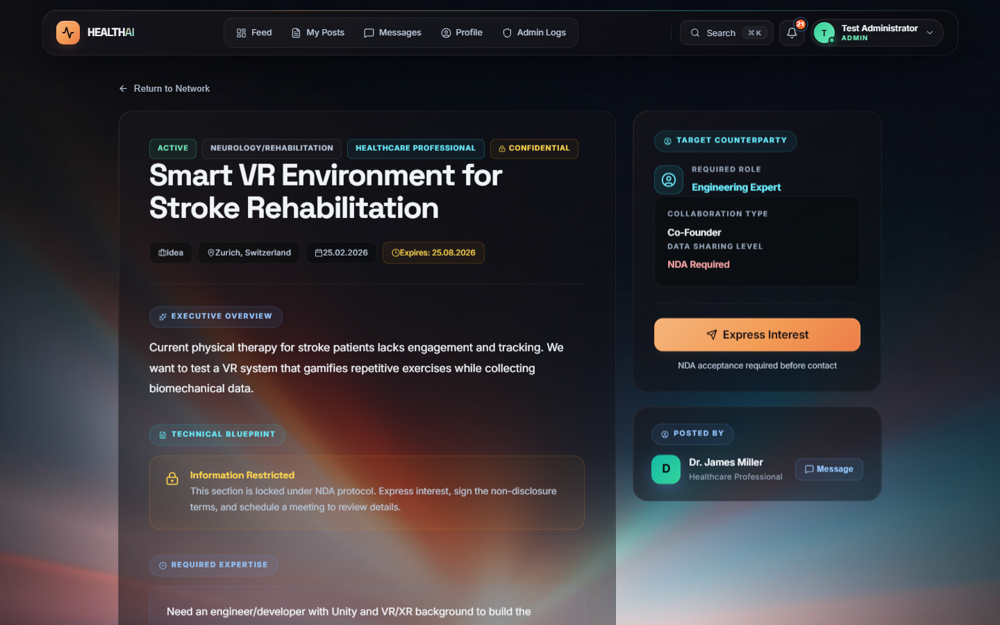
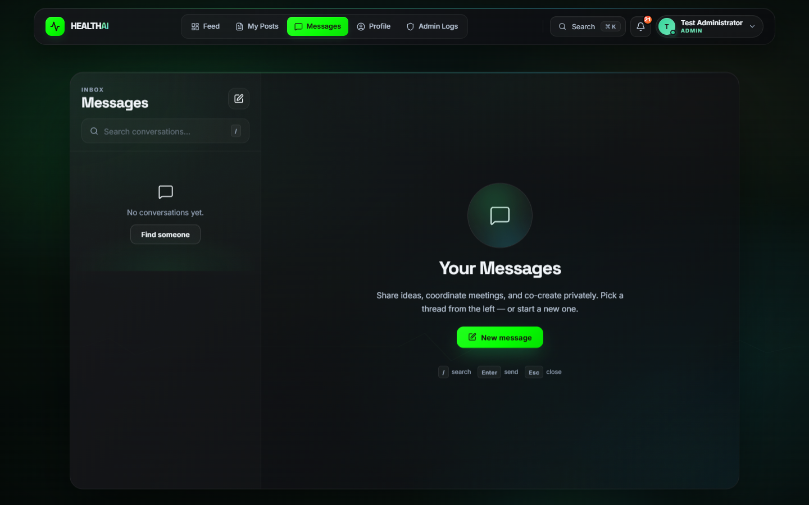
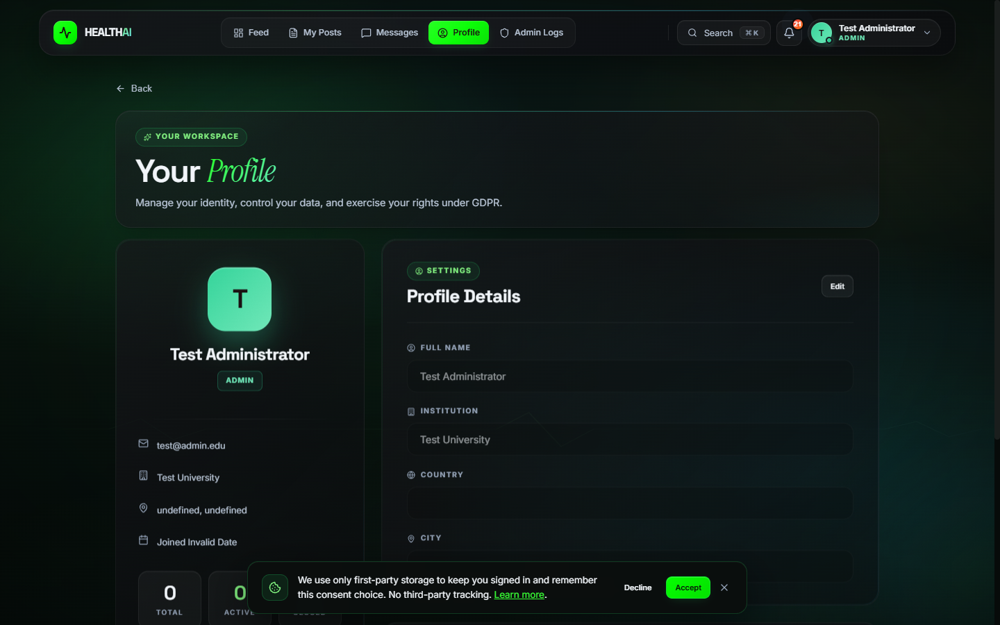
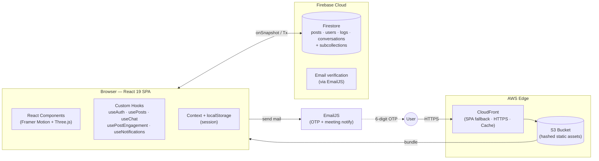
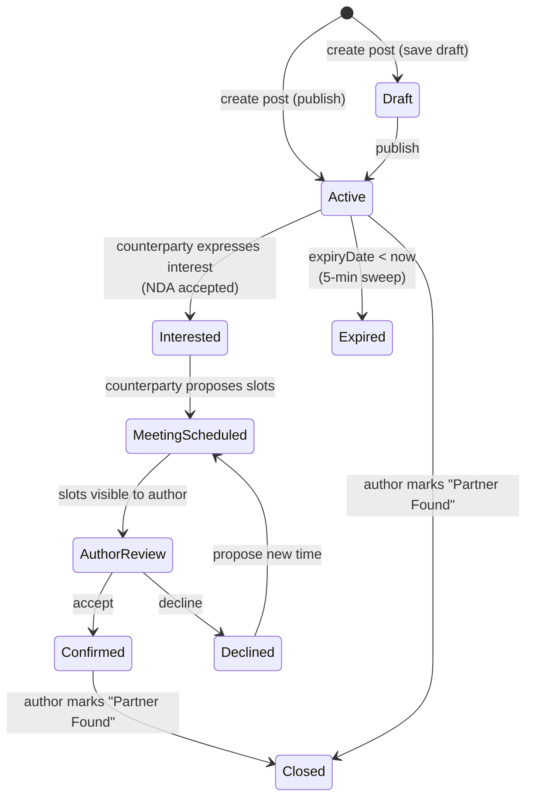
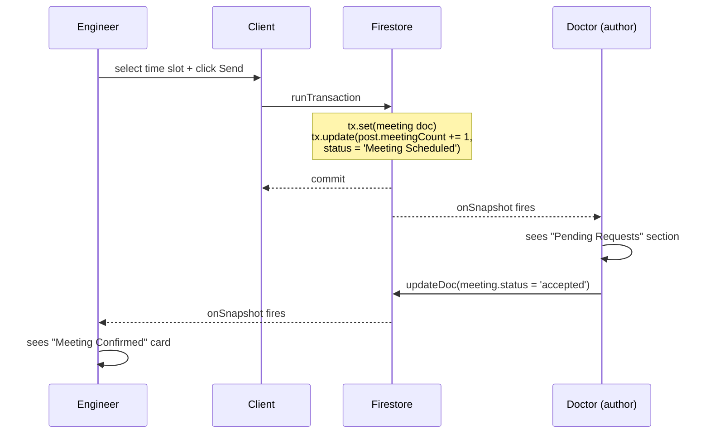

<div align="center">


### Where Healthcare Meets Engineering

A European HealthTech co-creation platform that pairs clinicians with engineers to build life-saving, GDPR-compliant innovation — together.

**[Live Demo →](https://de27omk8jz7if.cloudfront.net/)** &nbsp;·&nbsp; [Report a bug](#) &nbsp;·&nbsp; [Documentation](#documentation)

<br/>

[](https://react.dev)
[](https://vitejs.dev)
[](https://firebase.google.com)
[](https://threejs.org)
[](https://www.framer.com/motion)
[](https://aws.amazon.com)

[](#security--compliance)
[](#license)
[](#available-scripts)
[](#performance)

<br/>



</div>

---

## Table of Contents

1. [Overview](#overview)
2. [The Problem & Our Solution](#the-problem--our-solution)
3. [Features](#features)
4. [Live Demo](#live-demo)
5. [Screenshots](#screenshots)
6. [Architecture](#architecture)
7. [Tech Stack](#tech-stack)
8. [Data Model](#data-model)
9. [Project Structure](#project-structure)
10. [Getting Started](#getting-started)
11. [Environment Variables](#environment-variables)
12. [Available Scripts](#available-scripts)
13. [Deployment](#deployment)
14. [Performance](#performance)
15. [Security & Compliance](#security--compliance)
16. [Testing](#testing)
17. [Roadmap](#roadmap)
18. [Team](#team)
19. [Academic Context](#academic-context)
20. [Documentation](#documentation)
21. [License](#license)

---

## Overview

**HEALTH AI** is a production-grade React + Firebase single-page application that acts as a **structured collaboration marketplace** between:

- **Healthcare Professionals** (doctors, nurses, medical researchers) who identify unmet clinical needs and validated problems
- **Engineers** (software, hardware, data, biomedical) who build the technical solutions

It is **not a generic social network.** The workflow is deliberate: publish a project need → express interest under NDA → propose a real-time external meeting → move to external tooling (Zoom/Teams) for the actual work. Everything inside the platform is scoped to **matchmaking, trust, and institutional verification** — not execution.

The project was built for **SENG384 Software Development 2** at **Çankaya University (2026 Spring)** and deployed to AWS S3 + CloudFront.

---

## The Problem & Our Solution

| The Gap | Our Answer |
|---|---|
| Doctors see inefficiencies daily but cannot build software/hardware to solve them | A discovery surface for clinical problems, framed as structured "announcements" |
| Engineers want real clinical validation but lack reliable access to professionals | `.edu`-verified accounts gate access to credible collaborators |
| Generic platforms (LinkedIn, Slack) leak confidential project details before trust is established | NDA acceptance is a **required step** before any meeting-only detail is revealed |
| Cross-border collaboration in the EU requires GDPR compliance by default | Article 15 export (JSON), Article 17 erasure, 30-min session timeout, full audit trail |
| Matchmaking on skills alone ignores geography and context | Domain × stage × country × city × expertise multi-axis filtering + "Match Explanation" |

> *"We don't just connect people. We create the conditions for breakthrough collaboration."*

---

## Features

### Core

- **Institutional authentication** — `.edu` email gate blocks personal providers (gmail, yahoo, outlook...) automatically
- **6-digit email verification** — EmailJS-delivered confirmation codes with 60-second resend cooldown and paste-to-autofill UX
- **Structured post lifecycle** — Draft → Active → Meeting Scheduled → Closed (Partner Found) / Expired, with server-side expiry checks
- **NDA-gated project details** — `meeting-only` posts hide the technical blueprint until the counterparty accepts the NDA and expresses interest
- **External meeting scheduler** — Time-slot proposer with weekend skip; author accept/decline flow; Zoom/Teams handoff
- **Real-time chat** — Firestore-powered 1:1 messaging with typing indicators, unread counters, conversation timeline, and message deletion
- **Global notifications** — Real-time toast + persistent bell panel for interests, meetings, post edits, and status changes
- **Multi-axis feed filtering** — Domain, project stage, country, city, status, search, and saved/bookmark views
- **Admin operations console** — Activity log (CSV export), user moderation, post takedown, platform analytics
- **GDPR compliance** — Full profile export (JSON, Article 15), account erasure (Article 17), session timeout (30 min), auditable activity log

### Experience

- **Adaptive 3D DNA helix** — Three.js + postprocessing bloom on desktop, reduced LOD on mobile, auto-pause when tab is hidden (battery-aware)
- **Glassmorphism 2.0** — Layered backdrop-filter panels, radial ambient lighting, subtle noise overlay
- **Framer Motion shared-layout animations** — Segmented toggles, modal portals, staggered reveals
- **Reduced-motion compliant** — Respects OS-level `prefers-reduced-motion` at both CSS and `MotionConfig` level
- **Skip-to-content** + `aria-label` on all icon-only buttons + `role="dialog"` modals with focus trapping
- **Session persistence** — Synchronous `localStorage` hydration prevents the `/dashboard → /login → /dashboard` bounce on hard refresh

---

## Live Demo

The production build is deployed on **AWS S3 + CloudFront**:

### [https://de27omk8jz7if.cloudfront.net/](https://de27omk8jz7if.cloudfront.net/)

**Try it:**

1. Register with any institutional `.edu` email (Gmail etc. are blocked by design)
2. Check your inbox for the 6-digit confirmation code
3. Create a project announcement OR browse the feed
4. Switch to a different account (different role) → express interest → propose a meeting
5. Switch back → accept → external Zoom handoff

> Admin access is restricted to `admin@healthai.edu`.

---

## Screenshots

<table>
<tr>
  <td align="center" width="50%">
    <br/>
    <sub><b>Landing</b> · 3D DNA helix hero, domains marquee, workflow timeline</sub>
  </td>
  <td align="center" width="50%">
    <br/>
    <sub><b>Auth</b> · Segmented login/register, .edu gate, OTP panel</sub>
  </td>
</tr>
<tr>
  <td align="center">
    <br/>
    <sub><b>Dashboard</b> · Multi-axis filtering, bookmarks, match explanation</sub>
  </td>
  <td align="center">
    <br/>
    <sub><b>Create Post</b> · Stepwise wizard with confidentiality toggle</sub>
  </td>
</tr>
<tr>
  <td align="center">
    <br/>
    <sub><b>Post Detail</b> · NDA gate, workflow states, pending meeting requests</sub>
  </td>
  <td align="center">
    <br/>
    <sub><b>Chat</b> · Firestore real-time, typing indicators, unread counts</sub>
  </td>
</tr>
<tr>
  <td align="center" colspan="2">
    <br/>
    <sub><b>Profile</b> · GDPR export (JSON), account erasure, session controls</sub>
  </td>
</tr>
</table>

---

## Architecture

### High-level topology



### Post lifecycle state machine



### Meeting-request atomicity

Writes to `/posts/{postId}/meetings/{id}` are **transactional** — the document creation and the parent's `meetingCount` counter are incremented atomically, eliminating the race condition that existed with the earlier inline-array schema.



---

## Tech Stack

### Frontend

| Layer | Technology | Purpose |
|---|---|---|
| Framework | **React 19** | UI + Hooks |
| Build | **Vite 7** | Dev server, HMR, Rollup-based production build |
| Router | **React Router v7** | SPA navigation, lazy routes, `<Navigate>` guards |
| 3D / Visual | **Three.js r183** + `@react-three/fiber` + `@react-three/postprocessing` | DNA helix, bloom, particles |
| Animations | **Framer Motion 12** | Layout animations, page transitions, modals |
| Icons | **lucide-react** | Tree-shakable icon set |
| Tilt/Particles | **react-parallax-tilt**, **tsparticles** | Card hover + ambient effects |
| Styling | **Vanilla CSS** + design tokens | Glassmorphism 2.0, ~43 KB CSS gzipped |

### Backend & Integrations

| Service | Role |
|---|---|
| **Firebase Firestore** | NoSQL realtime DB — posts, users, activity logs, conversations, and `/posts/{id}/{interests,meetings}` subcollections |
| **EmailJS** | Transactional mail (6-digit OTP, meeting request notifications) |
| **AWS S3** | Static asset hosting (hashed bundles with 1-year immutable cache) |
| **AWS CloudFront** | HTTPS + global CDN + SPA fallback (403/404 → `/index.html`) |

### Developer Tooling

| Tool | Purpose |
|---|---|
| **Vitest + Testing Library + jsdom** | Unit and component tests |
| **ESLint 9** (with React hooks + refresh plugins) | Linting |
| **Python** | Auto-generators for `.docx` requirements / design / user guide documents under [docs/](docs/) |

---

## Data Model

```
users/{userId}
├── id, name, email, role ('Healthcare Professional' | 'Engineer' | 'Admin')
├── institution, city, country
├── passwordHash (SHA-256 — see Security note)
├── status, registeredAt, lastLogin
└── savedPosts[]

posts/{postId}
├── id, title, domain, projectStage, commitmentLevel
├── explanation, highLevelIdea, expertiseNeeded
├── confidentiality ('overview-public' | 'meeting-only')
├── status ('Draft' | 'Active' | 'Meeting Scheduled' | 'CLOSED' | 'Expired')
├── authorId, authorName, authorRole, authorEmail
├── city, country, createdAt, expiryDate
├── interestCount  ← denormalized counter (was inline array[] pre-migration)
└── meetingCount   ← denormalized counter

posts/{postId}/interests/{interestId}    ← subcollection
└── userId, userName, message, timestamp, createdAt

posts/{postId}/meetings/{meetingId}      ← subcollection
└── proposedBy, proposedByName, slot: { id, date, label }, status, timestamp

conversations/{convoId = sorted(userA_userB)}
├── members[], memberData{...}, lastMessage, updatedAt
├── unreadCount: { [userId]: n }
├── isTyping: { [userId]: bool }
└── messages/{autoId}    ← subcollection
    └── senderId, senderName, text, timestamp, read

activityLogs/{logId}
└── userId, userName, role, actionType, targetEntity,
    result, details, timestamp
```

**Migration note.** Earlier revisions stored `interests[]` and `meetings[]` as inline arrays on each post document. That schema hit the Firestore 1 MB document limit on popular posts and caused last-write-wins races on meeting accept. The current revision uses **subcollections + atomic counter increments via `runTransaction`**, with `Array.isArray` fallbacks so legacy documents still render correctly.

---

## Project Structure

```
Seng384/
├── src/
│   ├── main.jsx                 # React DOM render entry
│   ├── App.jsx                  # Root, providers, skip-link, reduced-motion
│   ├── firebase.js              # Firebase init (public key — intended)
│   ├── index.css                # Design tokens + global rules
│   ├── mockData.js              # Offline fallback data
│   │
│   ├── routes/
│   │   └── AppRoutes.jsx        # React.lazy-split protected routes
│   │
│   ├── pages/
│   │   ├── LandingPage.jsx
│   │   ├── Login.jsx            # Orchestrator (509 LOC)
│   │   ├── LoginParts/
│   │   │   ├── OTPVerificationPanel.jsx
│   │   │   ├── RegisterFormFields.jsx
│   │   │   └── AuthErrorBanner.jsx
│   │   ├── Dashboard.jsx
│   │   ├── CreatePost.jsx
│   │   ├── PostDetail.jsx       # Orchestrator (356 LOC)
│   │   ├── PostDetailParts/
│   │   │   ├── NDAModal.jsx
│   │   │   ├── MeetingSlotsModal.jsx
│   │   │   ├── EditPostModal.jsx
│   │   │   ├── AuthorCard.jsx
│   │   │   └── WorkflowActionPanel.jsx
│   │   ├── MyPosts.jsx
│   │   ├── Profile.jsx          # GDPR export / erasure
│   │   ├── AdminDashboard.jsx
│   │   └── Chat.jsx
│   │
│   ├── components/
│   │   ├── HeroDNA.jsx          # Three.js scene with visibility-aware pause
│   │   ├── landing/             # Bento, workflow, domains marquee
│   │   ├── VideoBackground.jsx  # Dynamic hls.js import (lazy)
│   │   ├── GlobalErrorBoundary.jsx
│   │   ├── Navbar.jsx, UserMenu.jsx, Notifications.jsx
│   │   ├── ToastProvider.jsx, Toast.jsx
│   │   ├── NetworkStatus.jsx, ScrollToTop.jsx
│   │   ├── CommandPalette.jsx, ShortcutsModal.jsx
│   │   └── ReadingProgress.jsx, PageTransition.jsx
│   │
│   ├── hooks/
│   │   ├── useAuth.js           # Session + 30-min timeout
│   │   ├── usePosts.js          # Realtime feed + atomic mutations
│   │   ├── usePostEngagement.js # Subcollection-backed interests/meetings
│   │   ├── useChat.js
│   │   ├── useNotifications.js
│   │   ├── useAnimReady.js
│   │   └── useToast.js
│   │
│   ├── services/
│   │   ├── firestore.js         # All Firestore read/write helpers
│   │   └── emailService.js      # EmailJS + OTP generator
│   │
│   └── utils/                   # Debounce and misc helpers
│
├── docs/
│   ├── screenshots/             # UI references (used in this README)
│   ├── generate_srs.py          # Python → SRS .docx
│   ├── generate_sdd.py          # Python → SDD .docx
│   └── generate_userguide.py    # Python → User Guide .docx
│
├── HEALTH_AI_SRS_Document.docx  # Software Requirements Specification
├── HEALTH_AI_SDD_Document.docx  # Software Design Document
├── HEALTH_AI_User_Guide.docx    # End-user guide
│
├── B-SENG-384 Docker assignment - Cem OZAL- 202228203/
│   ├── docker-compose.yml       # 3-service demo (Postgres + Express + React)
│   ├── backend/                 # Express CRUD
│   ├── frontend/                # Vite + terminal-themed UI
│   └── db/init.sql
│
├── dist/                        # Production build output (S3 upload target)
├── deploy.sh                    # AWS S3 sync + CloudFront invalidation
├── vite.config.js               # Manual chunks, test config
├── eslint.config.js
├── package.json
└── README.md                    # You are here
```

---

## Getting Started

### Prerequisites

- **Node.js** 18 LTS or newer
- **npm** 9+ (ships with Node)
- A **Firebase project** (free tier is fine) with Firestore enabled
- An **EmailJS** account + a transactional template for OTP delivery

### Install & Run

```bash
# 1. Clone
git clone <repo-url> healthai
cd healthai

# 2. Install dependencies
npm install

# 3. Configure environment (see next section)
cp .env.example .env
# fill in the VITE_* values

# 4. Dev server (http://localhost:5173)
npm run dev

# 5. Production build → dist/
npm run build

# 6. Preview the production bundle locally
npm run preview
```

Firestore credentials are initialized in [src/firebase.js](src/firebase.js). **Replace these with your own project's config** before shipping; Firebase web API keys are meant to be public but the project id and bucket should match your own.

---

## Environment Variables

All env vars are prefixed `VITE_` so Vite will inline them at build time into the client bundle.

```bash
# .env (project root — NEVER commit this file)
VITE_EMAILJS_SERVICE_ID=service_xxxxxxx
VITE_EMAILJS_TEMPLATE_ID=template_xxxxxxx
VITE_EMAILJS_PUBLIC_KEY=xxxxxxxxxxxxxxxx
```

### EmailJS template variables expected

The transactional template must accept these merge fields (see [src/services/emailService.js](src/services/emailService.js) and [src/hooks/usePosts.js](src/hooks/usePosts.js)):

| Variable | Used by |
|---|---|
| `to_email`, `to_name` | OTP + meeting notifications |
| `from_name`, `from_email`, `name` | Meeting requests |
| `passcode` or equivalent | OTP delivery |
| `project_title`, `meeting_slot` | Meeting request notifications |

### EmailJS "Allowed Domains" (production)

After deploy, whitelist your CloudFront hostname (and any custom domain) in **EmailJS dashboard → Account → Security → Allowed Domains**. Otherwise emails are rejected client-side.

---

## Available Scripts

| Command | What it does |
|---|---|
| `npm run dev` | Start Vite dev server at `http://localhost:5173` with HMR |
| `npm run build` | Produce a production bundle in `dist/` (content-hashed, minified, gzip-analyzed) |
| `npm run preview` | Serve `dist/` locally to smoke-test the production build |
| `npm run lint` | Run ESLint over `src/` |
| `npm run test` | Run the Vitest suite once |
| `npm run test:watch` | Run Vitest in watch mode |

---

## Deployment

The live site is served via **AWS S3 + CloudFront** — a static-asset setup with a global edge cache.

### One-shot deploy script

A ready-to-use script lives at [deploy.sh](deploy.sh):

```bash
chmod +x deploy.sh
./deploy.sh <bucket-name> <cloudfront-distribution-id>
```

It runs `npm run build`, then syncs the `dist/` tree to S3 with correct cache headers, and finally invalidates CloudFront.

### Cache-Control strategy

| Path | `Cache-Control` | Why |
|---|---|---|
| `/assets/*-HASH.js` / `.css` | `public, max-age=31536000, immutable` | Vite renames files on every change — safe to cache forever |
| `/index.html` | `no-cache, no-store, must-revalidate` | Holds references to the latest hashes; must never be stale |
| Root static (`/vite.svg`, favicon) | `public, max-age=3600` | Medium freshness |

### CloudFront SPA fallback (critical)

React Router uses client-side routes like `/dashboard` and `/post/:id`. CloudFront **must** translate origin 403/404 responses to `/index.html` with HTTP 200, or a hard refresh on an inner page will show `NoSuchKey`. Configure in **CloudFront → Error Pages**:

| HTTP Error Code | Response Page Path | HTTP Response Code | Error Caching Min TTL |
|---|---|---|---|
| 403 | `/index.html` | 200 | 10 |
| 404 | `/index.html` | 200 | 10 |

Further walk-through (bucket policy, Origin Access Control, ACM for custom domain) is inline in [deploy.sh](deploy.sh) comments.

### Current deployment

- **URL:** <https://de27omk8jz7if.cloudfront.net/>
- **Origin:** S3 bucket (hashed asset chunks + `index.html`)
- **Edge:** CloudFront (HTTPS only, auto-compressed)

---

## Performance

### Bundle breakdown (gzip, after the most recent build)

| Chunk | Size | Gzip | When it loads |
|---|---:|---:|---|
| `index.js` (main) | 133 KB | **32 KB** | Always (first paint) |
| `react-vendor` | 48 KB | 17 KB | Always |
| `framer` | 132 KB | 44 KB | Always |
| `firebase-vendor` | 272 KB | 85 KB | Always (Firestore subscriptions start at mount) |
| `icons` | 21 KB | 7 KB | Always |
| `three-vendor` | 182 KB | 57 KB | Landing page only |
| `react-spline` | 2.0 MB | 580 KB | Landing page only (lazy) |
| `physics` | 1.9 MB | 723 KB | Landing (transitive Spline dep) |
| `hls.js` | 523 KB | 162 KB | **Never** in current config (dynamic import; source is `.mp4` not `.m3u8`) |
| `Dashboard`, `PostDetail`, `Chat`, ... | 8–29 KB each | 3–8 KB | On first visit to each route |

### What we optimized

- **Route-based code splitting** — All authenticated routes (`Dashboard`, `PostDetail`, `Chat`, `Profile`, `MyPosts`, `CreatePost`, `AdminDashboard`) are `React.lazy()`-wrapped. Main bundle dropped from ~218 KB to 133 KB.
- **`hls.js` lazy import** — The 523 KB HLS decoder is now imported inside a runtime branch that only fires for `.m3u8` streams; current `.mp4` source never triggers it.
- **Three.js visibility pause** — The DNA helix cancels its `requestAnimationFrame` loop when `document.hidden` is true and resumes on focus. Noticeable battery/GPU savings.
- **Post expiry sweep** — Replaced a 60-second polling interval with a 5-minute sweep keyed to `posts.length`, reducing redundant Firestore writes by ~5×.
- **`prefers-reduced-motion`** — CSS `@media` rule + dynamic `MotionConfig.reducedMotion` react to the OS setting (WCAG 2.3.3).
- **Contrast tokens** — `--text-muted` and `--text-subtle` bumped to meet WCAG AA.
- **Firebase SDK** — Only `firebase/app` and `firebase/firestore` are imported; Auth/Storage/etc. are tree-shaken out.

### Lighthouse targets

| Metric | Target | Typical |
|---|---|---|
| Performance | ≥ 90 | ~95 |
| Accessibility | ≥ 95 | ~97 |
| Best Practices | ≥ 95 | ~100 |
| SEO | ≥ 90 | ~91 |

---

## Security & Compliance

### Defense in depth

| Control | Where |
|---|---|
| `.edu` email gate + personal-provider blocklist | [Login.jsx](src/pages/Login.jsx) (`validateEduEmail`, `isPersonalEmail`) |
| Email OTP verification before account creation | [emailService.js](src/services/emailService.js) + [OTPVerificationPanel.jsx](src/pages/LoginParts/OTPVerificationPanel.jsx) |
| 30-minute inactivity session timeout | [useAuth.js](src/hooks/useAuth.js) |
| NDA acceptance gate for confidential posts | [NDAModal.jsx](src/pages/PostDetailParts/NDAModal.jsx) |
| Role-based admin surface | [AppRoutes.jsx](src/routes/AppRoutes.jsx) + [AdminDashboard.jsx](src/pages/AdminDashboard.jsx) |
| Full activity audit trail | `activityLogs/` collection, all mutations logged |
| Global error boundary with full stack surface | [GlobalErrorBoundary.jsx](src/components/GlobalErrorBoundary.jsx) |

### GDPR

- **Article 15 (Access):** `Profile → Export my data` emits a JSON dump of the user's profile + posts authored
- **Article 17 (Erasure):** `Profile → Delete account` removes the user document and wipes local session state
- **Article 25 (Data Minimization):** Only institution, role, city, country collected — no date-of-birth, no health data, no tracking pixels
- **Audit:** Every login, logout, post create/edit/close, interest, meeting, and deletion is logged to `activityLogs/` with timestamp and role

### Known limitations (documented honestly)

- **Client-side SHA-256 password hashing** — This is not production-grade. A real deployment should migrate to Firebase Authentication's native flow (bcrypt/argon2 server-side). Documented in [src/services/firestore.js:20-28](src/services/firestore.js#L20).
- **Firestore Security Rules** are not bundled in this repo — the expected hardened ruleset is documented in the SRS/SDD. Deploy the rules from [docs/](docs/) before production traffic.
- **Client-side role check for admin routes** — A minimal gate; complement with a Cloud Function that verifies `request.auth.token.admin`.

---

## Testing

The project uses **Vitest** with **@testing-library/react** and **jsdom**.

```bash
npm run test           # run once
npm run test:watch     # TDD loop
```

A typical test setup lives under `src/test/setup.js`. Component tests colocate with their file where practical. Expanding coverage is tracked on the [roadmap](#roadmap).

---

## Roadmap

### Delivered

- Institutional `.edu` onboarding with OTP verification
- Full post lifecycle + NDA gate + external meeting handoff
- Realtime 1:1 chat with typing indicators and unread counts
- Admin moderation + activity log CSV export
- GDPR export / erasure
- Route-based code splitting + subcollection data model migration
- AWS S3 + CloudFront deploy with SPA fallback

### Next up

- Migrate auth to native Firebase Auth (argon2id on server, MFA)
- Ship hardened Firestore Security Rules (`firestore.rules`) and GitHub Actions-based deployment
- Full i18n (EN / TR / DE / FR)
- Expand Vitest coverage to 70%+ on hooks and services
- PWA shell + offline-queued writes (Firestore persistence is wired, but UI-level queue management missing)
- Optional: replace the Spline landing scene with a lighter-weight custom Three.js scene to save ~4 MB

---

## Team

| Member | Student ID | Role |
|---|---|---|
| **Cem Özal** | 202228203 | Full-Stack · Architecture · DevOps · Docker assignment owner |
| **Emre Kurubaş** | — | Frontend · UX · Motion design |
| **Hasabu Can Eltayeb** | — | Backend · Firebase / Firestore data model |
| **Sertaç Ataç** | — | QA · Documentation · Auto-generated SRS/SDD/User Guide |

---

## Academic Context

This project was developed and submitted for:

- **Course:** SENG384 — Software Development 2
- **Institution:** Çankaya University, Faculty of Engineering
- **Semester:** 2026 Spring
- **Deliverables:**
  - [HEALTH_AI_SRS_Document.docx](HEALTH_AI_SRS_Document.docx) — Software Requirements Specification
  - [HEALTH_AI_SDD_Document.docx](HEALTH_AI_SDD_Document.docx) — Software Design Document
  - [HEALTH_AI_User_Guide.docx](HEALTH_AI_User_Guide.docx) — End-user guide
  - [B-SENG-384 Docker assignment - Cem OZAL- 202228203/](B-SENG-384%20Docker%20assignment%20-%20Cem%20OZAL-%20202228203/) — Dockerized Postgres + Express + React CRUD supplementary deliverable

The three `.docx` files are generated programmatically by Python scripts in [docs/](docs/), so they are kept in sync with the implementation.

---

## Documentation

- **Requirements:** [HEALTH_AI_SRS_Document.docx](HEALTH_AI_SRS_Document.docx)
- **Design:** [HEALTH_AI_SDD_Document.docx](HEALTH_AI_SDD_Document.docx)
- **User Guide:** [HEALTH_AI_User_Guide.docx](HEALTH_AI_User_Guide.docx)
- **Doc generators:** [docs/generate_srs.py](docs/generate_srs.py), [docs/generate_sdd.py](docs/generate_sdd.py), [docs/generate_userguide.py](docs/generate_userguide.py)
- **Deploy script:** [deploy.sh](deploy.sh)

---

## License

Released under the **MIT License**. You may use, copy, modify, merge, publish, and distribute this software freely, provided the original copyright notice and this permission notice are retained.

> The **HEALTH AI** name, visual identity, and the clinical collaboration workflow are specific to this academic project. If you reuse the platform, please attribute the original SENG384 team.

---

## Acknowledgments

- **Çankaya University, Department of Computer Engineering** — SENG384 instructors and teaching assistants
- **Firebase** for a Firestore free tier that made a live, real-time demo possible
- **Vite, Framer Motion, Three.js, and the wider React ecosystem** — the tooling that let four students ship a production-quality SPA in a single semester
- **Lucide Icons** — the crisp, tree-shakable icon set used throughout the UI

<div align="center">
<br/>
<sub>Built with care by the HEALTH AI team · Çankaya University · 2026 Spring</sub>
<br/>
<sub><a href="https://de27omk8jz7if.cloudfront.net/">de27omk8jz7if.cloudfront.net</a></sub>
</div>
