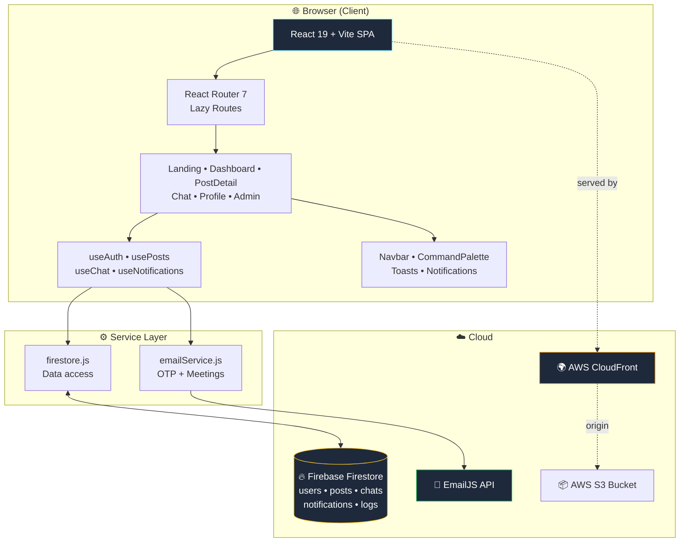
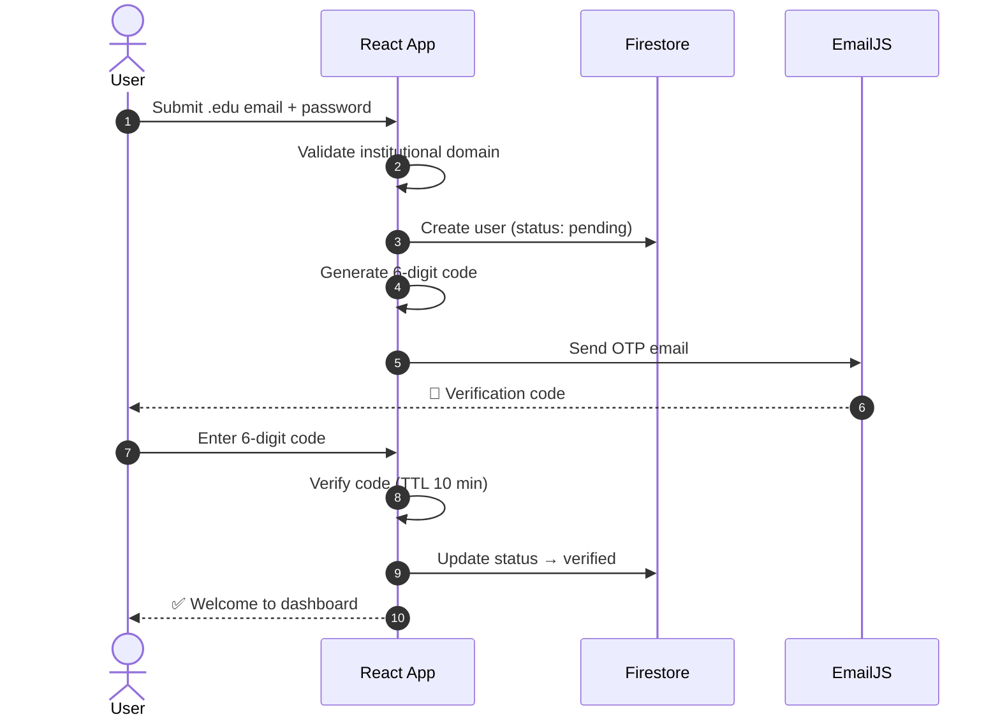
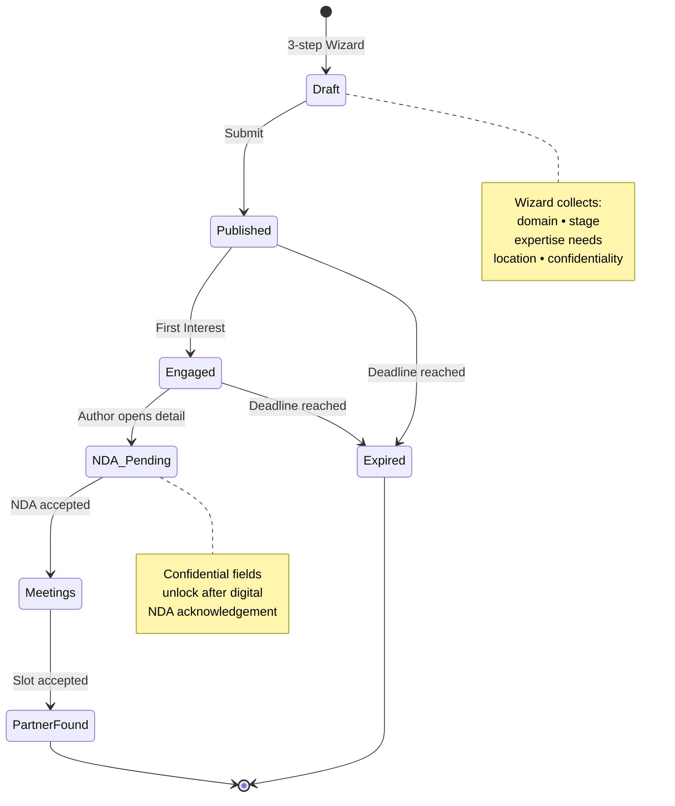
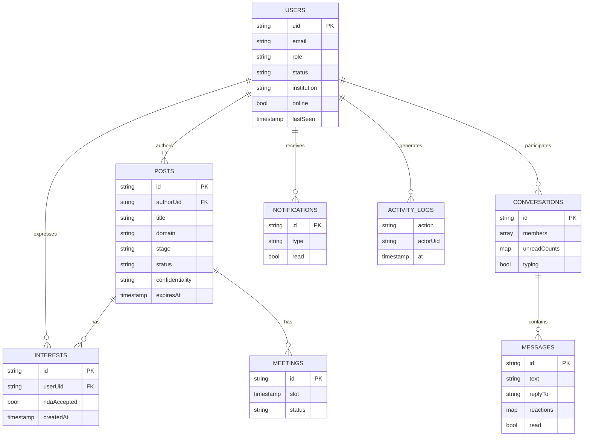
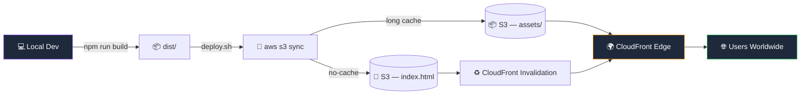

<div align="center">

# 🩺 HEALTH AI

### _Where verified healthcare meets engineering — a cinematic platform for health-tech partner discovery._

[](https://de27omk8jz7if.cloudfront.net/)
[](#)
[](#)

<br/>


<br/>


</div>

---

## ✨ What is HEALTH AI?

> **HEALTH AI** is a structured discovery platform that pairs **verified medical professionals** with **engineering teams** to launch health-tech collaborations — through institutional `.edu` registration, NDA-gated project details, scheduled meeting slots, and real-time chat.

Built as a **cinematic, product-style web app** rather than a static landing — every section breathes with Spline 3D, Framer Motion choreography, and a custom liquid-glass design system.

<br/>

<table>
<tr>
<td width="33%" align="center" valign="top">

### 🛡️ Verified Identity
`.edu` email + 6-digit OTP via EmailJS.<br/>No anonymous accounts.

</td>
<td width="33%" align="center" valign="top">

### 🤝 NDA-Gated Collaboration
Confidential project details unlock only after digital NDA acknowledgement.

</td>
<td width="33%" align="center" valign="top">

### 💬 Real-Time Chat
Typing indicators, presence, replies, reactions, unread badges — all on Firestore.

</td>
</tr>
<tr>
<td align="center" valign="top">

### 📅 Meeting Slots
Propose, accept, and decline meeting times directly inside the post workflow.

</td>
<td align="center" valign="top">

### 🎛️ Admin Oversight
Metrics, moderation, user management, activity logs, and CSV export.

</td>
<td align="center" valign="top">

### 🌐 GDPR-Aware
JSON data export, account deletion, audit trail for every sensitive action.

</td>
</tr>
</table>

---

## 🗺️ User Journey — From Curious Visitor to Active Partner

```mermaid
flowchart LR
    V([👤 Visitor]):::guest --> L[🎬 Cinematic Landing]
    L --> S{Sign up?}
    S -->|No| L
    S -->|Yes| R[📧 .edu Registration]
    R --> O[🔢 6-digit OTP]
    O --> D[🏠 Dashboard Feed]

    D --> B[🔍 Browse posts]
    D --> C[✍️ Create post]

    B --> P[📄 Post Detail]
    C --> P
    P --> I[💡 Express Interest]
    I --> N[🔒 NDA Modal]
    N -->|Sign| M[📅 Meeting Slots]
    M -->|Accept| W[🎉 Partner Found]
    W --> X[💬 Direct Chat]

    classDef guest fill:#1e293b,stroke:#7c3aed,color:#fff,stroke-width:2px
    classDef default fill:#0f172a,stroke:#1e90ff,color:#e2e8f0,stroke-width:1.5px
```



---

## 🏛️ System Architecture



---

## 🔐 Authentication & OTP Verification



---

## 📝 Post Lifecycle — From Draft to Partner Found



---

## 💬 Real-Time Chat Data Flow

```mermaid
flowchart LR
    A[👤 User A] -->|sends| MA[Message]
    B[👤 User B] -->|sends| MB[Message]

    MA --> CV[(conversations/&#123;id&#125;)]
    MB --> CV
    CV --> MS[(messages subcollection)]

    MS -->|onSnapshot| LA[🔴 Live render — A]
    MS -->|onSnapshot| LB[🔴 Live render — B]

    CV -.typing.-> LA
    CV -.typing.-> LB
    CV -.presence.-> LA
    CV -.presence.-> LB

    style CV fill:#1e293b,stroke:#FFCA28,color:#fff
    style MS fill:#1e293b,stroke:#FFCA28,color:#fff
    style LA fill:#0f172a,stroke:#22c55e,color:#fff
    style LB fill:#0f172a,stroke:#22c55e,color:#fff
```



---

## 🗄️ Firestore Data Model



---

## 📸 Screenshots

<table>
<tr>
<td width="50%" align="center">
<b>🎬 Landing</b><br/>

</td>
<td width="50%" align="center">
<b>🏠 Dashboard</b><br/>

</td>
</tr>
<tr>
<td align="center">
<b>✍️ Create Post</b><br/>

</td>
<td align="center">
<b>📄 Post Detail</b><br/>

</td>
</tr>
<tr>
<td align="center">
<b>💬 Chat</b><br/>

</td>
<td align="center">
<b>👤 Profile</b><br/>

</td>
</tr>
<tr>
<td colspan="2" align="center">
<b>🔐 Login & OTP</b><br/>

</td>
</tr>
</table>

---

## 🧰 Tech Stack

| Layer | Tools |
| --- | --- |
| 🎨 **Frontend** | React 19 • Vite 7 • React Router 7 |
| 🎬 **Animation & 3D** | Framer Motion 12 • Three.js • React Three Fiber • Drei • Spline • HLS Video |
| 🔥 **Data** | Firebase Cloud Firestore (subcollections, real-time listeners) |
| 📧 **Email** | EmailJS — OTP & meeting-request templates |
| 💎 **UI System** | Custom liquid-glass CSS • Lucide React icons • PxSelect • Skeletons • Toast provider • Wizard progress |
| 🧪 **Testing** | Vitest 4 • Testing Library • jsdom |
| ☁️ **Deployment** | AWS S3 + CloudFront via `deploy.sh` |

---

## 🛣️ Routes

| Route | Access | Purpose |
| --- | --- | --- |
| `/` | 🌍 Guest | Cinematic landing experience |
| `/login` | 🌍 Guest | Login, registration, and OTP verification |
| `/dashboard` | 🔓 Authenticated | Browse and filter announcements |
| `/create-post` | 🔓 Authenticated | Publish a collaboration announcement |
| `/post/:id` | 🔓 Authenticated | View details, NDA, meetings |
| `/my-posts` | 🔓 Authenticated | Manage own announcements |
| `/chat` | 🔓 Authenticated | Real-time direct messages |
| `/profile` | 🔓 Authenticated | Profile, GDPR export, account controls |
| `/admin` | 👑 Admin only | Users, posts, logs, metrics, CSV export |

---

## 🚀 Deployment Pipeline



```bash
./deploy.sh <bucket-name> <cloudfront-distribution-id>
```

---

## 🏁 Getting Started

### Prerequisites
- Node.js **20+** and npm
- A modern browser
- _(Optional)_ Firebase project — to point the app at your own database
- _(Optional)_ EmailJS credentials — for OTP & meeting emails

### Install & Run

```bash
git clone https://github.com/cozalss/SENG384-project.git
cd SENG384-project
npm install
npm run dev
```

Vite will print a local URL — usually `http://localhost:5173`.

### Environment Variables

Create a `.env` in the project root:

```bash
VITE_EMAILJS_SERVICE_ID=your_service_id
VITE_EMAILJS_TEMPLATE_ID=your_template_id
VITE_EMAILJS_PUBLIC_KEY=your_public_key
```

Firebase configuration currently lives in `src/firebase.js`. For production, move keys into environment-managed settings and enforce Firestore security rules.

---

## 📜 Scripts

| Command | Description |
| --- | --- |
| `npm run dev` | 🛠️ Start the Vite development server |
| `npm run build` | 📦 Create the production build in `dist/` |
| `npm run preview` | 👀 Preview the production build locally |
| `npm run lint` | 🧹 Run ESLint against `src/` |
| `npm run test` | ✅ Run Vitest once |
| `npm run test:watch` | 🔁 Run Vitest in watch mode |

---

## 📂 Project Structure

```text
Seng384/
├── 📄 index.html
├── ⚙️  vite.config.js
├── 🚀 deploy.sh
├── 📚 docs/
│   ├── 📸 screenshots/
│   └── 📝 generate_*.py            # SRS / SDD / User Guide generators
└── 📁 src/
    ├── 🎨 index.css • liquid-glass.css
    ├── 🔥 firebase.js
    ├── 📐 constants/landingData.jsx
    ├── 🧩 components/
    │   ├── 🎬 landing/             # Hero • CinematicStage • BentoFeatures…
    │   ├── 🪟 CommandPalette.jsx
    │   ├── 🔔 Notifications.jsx
    │   ├── 🍞 ToastProvider.jsx
    │   └── 🧭 WizardProgress.jsx
    ├── 🪝 hooks/                   # useAuth • usePosts • useChat …
    ├── 📄 pages/                   # Landing • Dashboard • PostDetail …
    ├── 🛣️  routes/AppRoutes.jsx
    ├── ⚙️  services/                # firestore.js • emailService.js
    └── 🧪 test/
```

---

## 📚 Documentation

The repository ships with the full academic deliverables:

- 📘 `HEALTH_AI_SRS_Document.docx` — Software Requirements Specification
- 📗 `HEALTH_AI_SDD_Document.docx` — Software Design Document
- 📕 `HEALTH_AI_User_Guide.docx` — Illustrated user guide

Generators live in `docs/`.

---

## ⚠️ Notes on Scope

This is an **academic prototype** for SENG384. The UI presents GDPR-aware workflows, data export, deletion, NDA acknowledgement, and audit logging — but a production launch should add hardened server-side authentication, formal legal review of NDA/GDPR text, Firestore security rules, rate limiting, and secret management.

---

## 👥 Team — Health Shield

> _SENG384 Software Development 2 — Spring 2026_

| 👤 Member | 🎯 Role |
| --- | --- |
| **Cem Özal** | Full-stack development |
| **Emre Kurubaş** | Frontend & UI/UX |
| **Hasabu Can Eltayeb** | Backend & Firebase |
| **Sertaç Ataç** | QA & documentation |

---

<div align="center">

### 🌟 Try the live experience

[](https://de27omk8jz7if.cloudfront.net/)

_Built with 🩺 for safer collaboration in health-tech._

</div>
